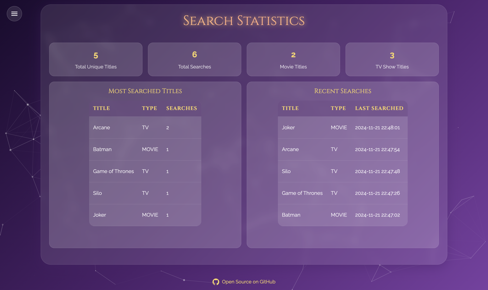

# Movie Suggestor 🎬

Movie Suggestor is an intelligent movie and TV show recommendation platform powered by advanced algorithms and AI. Get personalized content suggestions based on your preferences and discover your next favorite entertainment.

## Features ✨

- Smart movie and TV show recommendations
- AI-powered content suggestions
- Advanced filtering options
- Detailed movie/show information
- Real-time popularity tracking
- Beautiful, responsive UI with particle effects
- Cross-platform compatibility

## Technologies Used 🛠

- Python/Flask
- HTML5/CSS3
- JavaScript
- Bootstrap 5
- Particles.js
- TMDb API
- OpenAI API

## Getting Started 🚀

1. Clone the repository:
   git clone https://github.com/berkay-digital/MovieSuggestor

2. Install dependencies:
   pip install -r requirements.txt

3. Create a .env file with your API keys:
   TMDB_API_KEY=your_tmdb_api_key
   OPENAI_API_KEY=your_openai_api_key
   FLASK_SECRET_KEY=your_secret_key

4. Run the application:
   python app.py

5. Open http://localhost:5001 in your browser

## Screenshots 📸

### Search Page

### Overview Page

### AI Page

### About Page

### Stats Page

## Contributing 🤝

Contributions are welcome! Please feel free to submit a Pull Request.

1. Fork the repository
2. Create your feature branch
3. Commit your changes
4. Push to the branch
5. Open a Pull Request

## License 📝

This project is licensed under the MIT License - see the LICENSE file for details.

## Acknowledgments 🙏

- TMDb for their comprehensive movie database
- OpenAI for their powerful AI capabilities
- All contributors who helped improve this project
